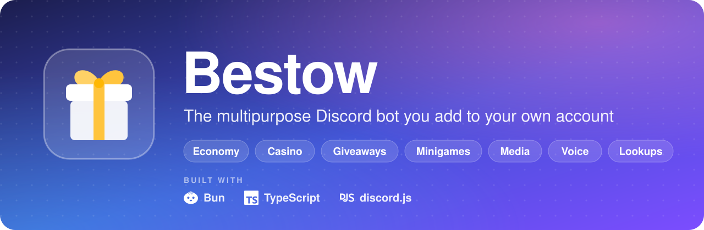

<h1 align="center">
  <a href="https://discord.com/oauth2/authorize?client_id=1553093201496375407"></a>
</h1>

<p align="center">
  <a href="https://discord.com/oauth2/authorize?client_id=1553093201496375407"></a>
  <a href="https://bun.sh"></a>
  <a href="https://www.typescriptlang.org"></a>
  <a href="https://discord.js.org"></a>
  <a href="LICENSE"></a>
</p>

<p align="center">
  <a href="#add-bestow-to-discord"><b>Add to Discord</b></a> &nbsp;•&nbsp;
  <a href="#features"><b>Features</b></a> &nbsp;•&nbsp;
  <a href="COMMANDS.md"><b>Command list</b></a> &nbsp;•&nbsp;
  <a href="#privacy-by-design"><b>Privacy</b></a> &nbsp;•&nbsp;
  <a href="#run-your-own-copy"><b>Self-host</b></a> &nbsp;•&nbsp;
  <a href="#development"><b>Contribute</b></a>
</p>

**Bestow** is a free, open-source, multipurpose **Discord bot** you install **on your own account** and use anywhere — any server, DM or group chat — without anyone having to add it to a server first. Economy with real depth, a casino, giveaways, minigames, media editing, free text-to-speech and singing, AI tools, game and social lookups, and small community tools, with **no tracking, no data selling, and a `/privacy` command that shows, exports and erases exactly what it stores about you**.

Built with TypeScript, [Bun](https://bun.sh) and [discord.js](https://discord.js.org). Every command is listed in [COMMANDS.md](COMMANDS.md), which is generated from the code so it is always accurate.

## Add Bestow to Discord

<div align="center">
<table>
<tr>
<td align="center">
<br>
<a href="https://discord.com/oauth2/authorize?client_id=1553093201496375407"></a>
<br><br>
<a href="https://discord.com/oauth2/authorize?client_id=1553093201496375407&integration_type=1&scope=applications.commands"></a>
&nbsp;
<a href="https://discord.com/oauth2/authorize?client_id=1553093201496375407&scope=bot+applications.commands&permissions=1374812499030"></a>
<br>
<sub>Free · nothing to host · works in servers, DMs and group chats</sub>
<br><br>
</td>
</tr>
</table>
</div>

Bestow is a **user-install** app. Commands are registered globally and work in servers, DMs and group DMs:

<table>
<tr>
<th width="50%">👤 Add it to your account</th>
<th width="50%">🏠 Add it to a server as well</th>
</tr>
<tr>
<td valign="top">Use it anywhere. Nobody needs to be an admin, and it is not tied to one server. Economy, games, media, lookups and tools all work this way.</td>
<td valign="top">Unlocks the things Discord only lets a server-installed bot do: giveaways (which edit a message over hours or days), levels and XP, <code>/config</code> and <code>/server</code> settings, and other features that react to what happens in a channel. Those commands tell you when the bot isn't in the server.</td>
</tr>
</table>

> [!NOTE]
> **Heist parity.** Bestow has every command on [Heist](https://heist.lol/commands)'s list, with Heist's own descriptions, options and choices ([`docs/heist-spec.json`](docs/heist-spec.json)); `tests/parity.test.ts` fails if anything goes missing or drifts, and `bun scripts/parity.ts` prints the details. The few commands deliberately not built (harassment, doxxing or account-enumeration tools) are listed with their reasons in [`docs/heist-parity.json`](docs/heist-parity.json). Commands Heist doesn't have (levels, reminders, guessing games…) are Bestow extras.

## Features

<table>
<tr>
<td width="50%" valign="top">

### 💰 Economy
`/eco` · `/eco-company`

Wallet card you can restyle in a live **studio**, bank, daily/monthly/work/hustle/beg/bonus, robbing (and mob protection against it), businesses, labs, investments, quests and trading cards (Business, Lab and Personal; Standard and Blackice cases). Amounts like `all`, `half` or `10k`. **Companies** with shared vaults and projects, leaderboards, and economy-funded giveaways.

Balances change through guarded single-statement updates, so races can't duplicate or lose money.

</td>
<td width="50%" valign="top">

### 🎰 Casino
`/eco games`

Blackjack, roulette, slots, crash, plinko, video poker, scratch cards, mines, towers, ladder, higher-or-lower, dice, high roll and coin flip, plus a progressive jackpot, odds explainers, lifetime stats and per-game leaderboards.

</td>
</tr>
<tr>
<td width="50%" valign="top">

### 🎁 Giveaways
`/giveaway` · `/eco giveaway`

Button-entry giveaways that survive restarts, rerolls that don't pick anyone twice until everyone who entered has won, and coin-funded pots held in escrow (25% tax on payout, refunded if cancelled).

</td>
<td width="50%" valign="top">

### 🎮 Games
`/games` · `/community guess` · `/guess`

Tic-tac-toe, rock-paper-scissors, head-to-head blackjack, snake and a cookie race, all played with buttons, against a friend or the first person to press Join. Plus a **movie, TV, video-game and song guessing game** that keeps going, round after round, until someone presses Stop game.

<details>
<summary>How guessing works in DMs, group chats and servers</summary>

In a DM with the bot you just type your guesses. In a group chat Discord doesn't let a user-installed bot read messages, so answers come from `/guess <answer>` or a button, and the guesses, hints and skip votes are cleared away when each round ends; the finished round itself deletes after 5 minutes (DMs and group chats). In a server where Bestow is added as a server bot, an admin can give the game its own channel (`/server guess setup`) and guesses are typed there, as they were in TMCBot.

</details>

</td>
</tr>
<tr>
<td width="50%" valign="top">

### 🎬 Media
`/media` · `/audio` · `/download`

Dozens of image, GIF and video effects, animated [MakeSweet](https://makesweet.com) scenes (billboard, flag, Rubik's cube, heart locket…, made by MakeSweet itself through its API), audio effects, frame extraction, `/gif` and `/voicemessage`. `/download` and `/soundcloud` fetch from YouTube, TikTok, X, Reddit, SoundCloud and more via yt-dlp, and `/shazam` or right-click **Identify Song** recognises music.

</td>
<td width="50%" valign="top">

### 🗣️ Voice
`/tts`

Free local voices (Kokoro, with Microsoft Edge voices as the online fallback), character voices and singing voices, plus optional ElevenLabs voices and AI singers through an ACE-Step server you run. Output as a file or a Discord **voice message**.

</td>
</tr>
<tr>
<td width="50%" valign="top">

### 🤖 AI
`/ai` · @mention · DMs

ChatGPT-style answers with **Reply n/3** conversations, a second model (`/ai llama`), image generation and editing (`/ai imagine`, `edit-imagine`), Perplexity web search, OpenAI voices, your own **custom AI**, image reading, transcripts, summaries, fact-checks, geolocation (never addresses or homes), comedy bits (`/ai fun`), personas and opt-in memory. Right-click **AI Tools**, **Transcribe Audio** and **Translate Message**.

Works with any OpenAI-compatible provider, including local ones. Free accounts get **20 requests per hour**; Premium removes the limit. Server admins can turn @mention chat on or off with `/ai config`.

</td>
<td width="50%" valign="top">

### 🔎 Lookups
Game, social, music and crypto lookups:

- **Games:** `/roblox`, `/rolimons`, `/minecraft`, `/fortnite`, `/valorant`, `/steam`
- **Social:** `/instagram`, `/tiktok`, `/x`, `/twitch`, `/youtube`, `/snapchat`, `/telegram`, `/pinterest`, `/medaltv`, `/cashapp`, `/bio`, `/github`, `/get` (profile pictures and banners)
- **Music:** `/lastfm`, `/spotify`, `/lyrics`
- **Crypto:** `/crypto`, `/ton`

</td>
</tr>
<tr>
<td width="50%" valign="top">

### 🧰 Utility
`/translate`, `/badtranslate`, `/define`, `/search`, `/qr`, `/color`, `/convert`, `/math`, `/base64`, `/paste`, `/dns`, `/ip`, `/website` (screenshots, scrolling videos, source downloads), `/bypass`, `/discord`, `/avatar`, `/banner`, `/tags`, `/timezone`, `/markov-chain` and `/ping`. Quote images with your own presets (`/quotemessage` and right-click **Quote Message**), and right-click **View Profile**.

</td>
<td width="50%" valign="top">

### 🎉 Fun
Anime action GIFs (`/action`), `/ship`, `/rate`, `/rating`, `/rizz`, `/roast`, `/petpet`, `/emojimix`, `/asciify`, `/say`, `/urban`, `/8ball`, `/coinflip`, `/nitro`, a fictional `/juul`, `/button`, and right-click **Pet User**, **Rizz User** and **Roast User**.

`/generate` makes fake Discord messages, replies, conversations, reports, applications, friend requests and voice channels in Discord's themes and display-name fonts (each marked as not real), plus Among Us cards, Spotify lyrics, AI watermarks and a tier-list builder.

</td>
</tr>
<tr>
<td width="50%" valign="top">

### 🫂 Community & server tools
`/community` · `/config` · `/server` · `/pingonjoin` · `/serverprofile`

Levels and reputation, birthdays, reminders, self-assignable roles, weather, trivia and other small extras, a free-game tracker, weekly/yearly rewards and the item shop.

Server settings cover counting, starboard, topic rotation, server stats and stat channels, streaming announcements, free-game posts, sticky messages, level roles, reaction roles, bulk role changes, the server economy and daily lottery, ping-on-join and the guessing-game channel. `/serverprofile` sets the bot's avatar, banner, bio and nickname in that server.

</td>
<td width="50%" valign="top">

### ✨ Premium & ℹ️ Info
`/premium` · `/help`

**Premium:** unlimited AI, no personal daily ElevenLabs limit, and the commands marked ✨ in [COMMANDS.md](COMMANDS.md) (wallet-card styling, the monthly reward, video effects, `/ai imagine`, custom AIs, Instagram lookups, website downloads and more). Sold through Discord itself; gift codes and owner grants are supported.

**Info:** `/help`, `/about`, `/invite`, `/plus` (a second copy of the bot, if you run one), `/me`, `/donate`, `/customize`, `/getbotinvite`, `/serveravatar`, `/serverbanner`.

</td>
</tr>
</table>

<p align="center">
  <a href="COMMANDS.md"></a>
</p>

## Privacy by design

<table>
<tr>
<th width="50%">✅ What Bestow stores</th>
<th width="50%">🚫 What it never stores</th>
</tr>
<tr>
<td valign="top">IDs, settings, game progress and things you deliberately enter (a reminder, a birthday, a wallet style).</td>
<td valign="top">A log of chat messages, DMs, emails, phone numbers or IP addresses.</td>
</tr>
</table>

- 🔒 **`/privacy`** shows the policy, what it has on you, a full JSON export and erase-everything; **`/settings`** manages the rest.
- 💬 Message content is read in memory only by the features that need it (counting, XP counters, @mention chat) and is then discarded.
- 🧠 The AI never reads channel history. Generators use only what the person types; chat uses only the reply chain it belongs to; memory is **off by default** and holds only notes the person saves on purpose. Conversations live in memory for 30 minutes and never touch the disk.
- 🧪 `src/privacy/registry.ts` lists every table that identifies a person, and **a test fails if someone adds one without registering it**, so `/privacy export` and `/privacy delete` can't silently miss data. Another test fails if a new free-text column appears that might hold chat content.
- 📡 The *Presence* intent is off unless you opt in, and there is no telemetry.
- 🌐 Commands that call outside services send only what you typed into that command (listed in `/privacy policy`).

## Run your own copy

> [!TIP]
> You only need this to host Bestow yourself. To just use it, [add the hosted bot](https://discord.com/oauth2/authorize?client_id=1553093201496375407).

### 1. Create the Discord application

You must do this yourself:

1. <https://discord.com/developers/applications> → **New Application**.
2. **Installation** tab: enable both **User Install** and **Guild Install**. To make a plain `https://discord.com/oauth2/authorize?client_id=<CLIENT_ID>` link work (Discord then asks "account or server?"), set **Install Link** to *Discord Provided Link* and give Guild Install the `applications.commands` and `bot` scopes.
3. **Bot** tab → **Reset Token** → copy it (shown once). Under *Privileged Gateway Intents* enable **Message Content** and **Server Members**. Leave *Presence* off unless you want streaming announcements (`/config streaming`); then turn it on here and set `ENABLE_PRESENCE_INTENT=1`.
4. Copy the **Application ID** (that is `CLIENT_ID`).

> [!WARNING]
> Never commit or share the token or client secret. If either leaks, reset it immediately.

### 2. Configure

```bash
cp .env.example .env      # fill in TOKEN and CLIENT_ID; every other setting is documented in the file
bun install
```

> [!IMPORTANT]
> Keep the database (`./data/bestow.db` by default, or `DB_PATH`) on a **local disk**. The bot refuses to start with it inside OneDrive, Dropbox or Google Drive (unless you set `ALLOW_SYNCED_DB=1`), because sync clients corrupt SQLite files.

### 3. Run

```bash
bun run start:production     # or: bun run dev   (restarts on changes)
```

Commands are registered globally on every start (plus `/staff` in `SUPPORT_GUILD_ID`, if set). Global registration can take a little while to show up in Discord's client.

`/invite` (and `/plus`) give the links for your copy, or you can build them from your application id:

```
Your account:  https://discord.com/oauth2/authorize?client_id=<CLIENT_ID>&integration_type=1&scope=applications.commands
A server:      https://discord.com/oauth2/authorize?client_id=<CLIENT_ID>&scope=bot+applications.commands&permissions=1374812499030
```

The server link asks for the permissions the bot needs (messages, embeds, files, reactions, roles, channels, nicknames, moderation and voice), never Administrator.

### 🐳 Docker

```bash
docker compose up -d --build
```

The image includes ffmpeg, yt-dlp, Instaloader and Chromium, tries to build the optional native image addon, runs as an unprivileged user in production mode, and keeps its database, voice models and uploads on the `bestow-data` volume. The compose project is named `bestow`. If port 3000 is taken on your machine, publish the dashboard elsewhere with `WEB_PORT=3100 docker compose up -d --build`.

### ✨ Selling Premium

Discord handles the payment, so Bestow never sees a card number. Create a subscription SKU (and, for gifts, a consumable SKU) in the Developer Portal under **Monetization** and put the ids in `.env` (`PREMIUM_SKU_ID`, `PREMIUM_GIFT_SKU_ID`). People can then buy it from `/premium buy` and gift it with `/premium gifts`. Owners listed in `OWNER_IDS` always have it, and can give or take it away with `/staff premium-grant` and `/staff premium-revoke`. `/staff` is only registered in your support server (`SUPPORT_GUILD_ID`), so nobody else sees it.

Until a subscription SKU is configured there is nothing to buy, so ✨ commands stay open to everyone. Setting `PREMIUM_SKU_ID` is the switch that turns the gate on.

### ⚙️ Optional features

Everything below is optional; each setting is also documented in [`.env.example`](.env.example).

<details>
<summary><b>🤖 AI providers</b></summary>
<br>

| Feature | What to set up |
|---|---|
| **Chat** | `LLM_BASE_URL`, `LLM_API_KEY`, `LLM_MODEL` (OpenAI, xAI, Groq, OpenRouter, or local Ollama/LM Studio). `LLM_LABEL` sets the name shown in reply footers. |
| **More models** | `LLAMA_*` configures `/ai llama`, `VISION_*` image understanding and `WHISPER_*` transcripts. `CUSTOM_AI_MODELS` lists the models a custom AI can use. |
| **Images, search, voices** | `IMAGE_*` sets up `/ai imagine` and `edit-imagine`, `PERPLEXITY_API_KEY` `/ai perplexity`, and `OPENAI_API_KEY` `/ai tts openai`. |
| **Spend limits** | `AI_USER_LIMIT` (default 20 an hour), `AI_DAILY_LIMIT` and `AI_DISABLED`. |

</details>

<details>
<summary><b>🎬 Voice, media and downloads</b></summary>
<br>

| Feature | What to set up |
|---|---|
| **TTS** | Nothing. The free voices download on first use (about 90 MB, cached in `data/models`). |
| **ElevenLabs voices** | `ELEVENLABS_API_KEY` (the secret key starting with `sk_`) adds your account's voices to `/tts`. `ELEVENLABS_FREE_CHARS_PER_DAY` limits each person (Premium isn't limited) and `ELEVENLABS_DAILY_CHARS` caps the whole bot. |
| **AI singers** | Run an [ACE-Step 1.5](https://github.com/ace-step/ACE-Step-1.5) API server and set `ACESTEP_URL`. Needs a capable GPU; the bundled singing voices work without it. |
| **/media makesweet** | `MAKESWEET_API_KEY` from a MakeSweet account. A free account covers seven of the scenes; flag2, book, toaster and valentine need MakeSweet Deluxe. |
| **/download**, **/soundcloud** | Needs `yt-dlp` on `PATH` (included in Docker). Some sites demand a login or bot check from datacenter IPs; set `YTDLP_COOKIES` to a cookies file if so. |
| **/instagram repost** | Nothing for public posts. They are read from [OGInstagram](https://github.com/seirenkr/OGInstagram) in one request (`OGINSTAGRAM_URL` points at another instance), the way `/x repost` reads FxTwitter: photos, carousels and videos come back as a full repost card (likes, comments, views, when it was posted) that goes out at once, with the media shown from their links and then swapped for uploaded copies of whatever fits the upload limit. When OGInstagram can't answer, [Instaloader](https://github.com/instaloader/instaloader) (included in Docker) reads the post instead. Public posts need no login; if Instagram asks Instaloader for one, point `INSTALOADER_USER` and `INSTALOADER_SESSIONFILE` at a session made with `instaloader --login`. |
| **/tiktok repost** | Nothing. Posts are read from [fxTikTok](https://github.com/okdargy/fxTikTok) (tnktok.com; `TNKTOK_URL` points at another instance) in one request and sent the same quick way, with likes, comments, shares and when it was posted; TikWM is the fallback. |
| **Website screenshots** | `CHROMIUM_PATH` (set in Docker) enables clicking, delays, scrolling videos and full-page captures in `/website`; without it, screenshots come from thum.io. |

</details>

<details>
<summary><b>🔎 Lookups, music and search</b></summary>
<br>

| Feature | What to set up |
|---|---|
| **Lookup keys** | Many lookups work without a key, and a key only raises their limits. These need one to work at all: the guessing game's movie/TV and video-game rounds (`TMDB_API_KEY`, `RAWG_API_KEY`; song rounds use Deezer and need nothing), `/twitch` (`TWITCH_CLIENT_ID`, `TWITCH_CLIENT_SECRET`), `/community weather` (`WEATHER_API_KEY`), `/community gif` (`TENOR_API_KEY`), Valorant player stats (`HENRIK_API_KEY`), Fortnite stats (`FORTNITE_API_KEY`) and Roblox followers/following (`ROBLOX_COOKIE` from a spare account, never your main one). |
| **Music** | `LASTFM_API_KEY` (and `LASTFM_API_SECRET` for the proper login and love/unlove) for `/lastfm`; `SPOTIFY_CLIENT_ID`/`SPOTIFY_CLIENT_SECRET` for `/spotify` (Deezer is used without them); `AUDD_API_TOKEN` for `/shazam` and Identify Song. |
| **Web search** | Set `SEARXNG_URL` to your own SearXNG instance; otherwise `/search` uses DuckDuckGo, with Wikipedia as the last fallback. |

</details>

<details>
<summary><b>✨ Premium, support server and dashboard</b></summary>
<br>

| Feature | What to set up |
|---|---|
| **Premium** | `PREMIUM_SKU_ID`, `PREMIUM_GIFT_SKU_ID`, `PREMIUM_GIFT_DAYS`, `OWNER_IDS`. |
| **Support server** | `SUPPORT_GUILD_ID` and `SUPPORT_INVITE` power `/eco joinbonus`; with `PREMIUM_ROLE_ID` they also enable `/premium syncrole`. `SUPPORT_GUILD_ID` is also where the owner-only `/staff` command is registered. |
| **Bestow+ and donations** | `PLUS_CLIENT_ID` points `/plus` at a second copy of the bot; `DONATE_URL` adds a donate button to `/donate leaderboard`. |
| **Web dashboard** | `WEB_PORT`, `WEB_URL`, `DISCORD_CLIENT_SECRET`. The dashboard only starts when `DISCORD_CLIENT_SECRET` is set; add `<WEB_URL>/auth/callback` as a redirect in the Developer Portal's **OAuth2** tab. Use https in production. |

</details>

## Development

```bash
bun run check          # typecheck + command validation + all tests
bun run docs           # regenerate COMMANDS.md (a test fails if it's stale)
bun test               # offline tests
bun scripts/parity.ts  # Heist parity: anything missing or different
RUN_NET_TEST=1 bun test        # also hit the real third-party APIs and yt-dlp
RUN_TTS_TEST=1 bun test        # also synthesise with the real voice model
RUN_BROWSER_TEST=1 CHROMIUM_PATH=/path/to/chromium bun test   # also drive a real headless Chromium
```

<details>
<summary><b>Notes for contributors</b></summary>
<br>

- **Discord allows 100 top-level slash commands, 25 entries per level and two levels of nesting.** Commands are grouped with `defineGroup` (`src/framework/group.ts`): one registered command, many small handler modules. `bun run validate` reports the budget and payload sizes. Mark a subcommand `premium: true` to make it a ✨ command.
- **Everything works with no server.** In DMs and user installs there is no guild, so per-user data is keyed by user id (economy uses a `global` scope). `tests/dm.test.ts` runs every economy command with no guild.
- **Money is atomic.** Balances change only through guarded single-statement updates, and read-modify-write flows serialise on a keyed mutex (`src/framework/mutex.ts`). Bun's SQLite driver does **not** isolate transactions on one connection, so don't rely on `db.begin`.
- **Never decode a user-supplied image with `loadImage` directly.** `@napi-rs/canvas` segfaults the whole process on corrupt PNG/JPEG data. Use `safeLoadImage` (`src/framework/imgsafe.ts`), which decodes in a separate ffmpeg process first.
- **User-supplied URLs** go through `getBufferPublic` (blocks private, loopback and link-local addresses, and re-checks every redirect).
- Third-party lookups keep parsing (pure, unit-tested against captured responses) separate from fetching (opt-in live tests).
- The Linux image builds the native canvas addon, so run the test suite inside it when you touch anything image-related.

</details>

<details>
<summary><b>Known limitations</b></summary>
<br>

- Command registration and login are verified against the real gateway, but most button, modal and voice-message flows are covered by tests with fake interactions rather than a live session. Smoke-test in a private server first.
- Commands that need Discord events or long-lived message edits (giveaways, levels, server tools) require the bot to be installed in the server. Elsewhere they say so.
- ACE-Step singing is tested against a mock server, not the real model.
- The optional native image addon (`natives/`) needs libvips, fontconfig and cmake; without it those legacy effects are disabled.
- AI output can be wrong, and the comedy generators rely on the provider's own content filtering plus the bot's safety prompt.
- Some commands only work once their key or login session is set in `.env` (see **Lookups, music and search** above). Without it they say what's missing.

</details>

## Built with

<table align="center">
<tr>
<td align="center" width="112"><a href="https://bun.sh"></a><br><sub><b>Bun</b></sub></td>
<td align="center" width="112"><a href="https://www.typescriptlang.org"></a><br><sub><b>TypeScript</b></sub></td>
<td align="center" width="112"><a href="https://discord.js.org"></a><br><sub><b>discord.js</b></sub></td>
<td align="center" width="112"><a href="https://discord.com/developers/docs"></a><br><sub><b>Discord</b></sub></td>
<td align="center" width="112"><a href="https://bun.sh/docs/api/sqlite"></a><br><sub><b>SQLite</b></sub></td>
<td align="center" width="112"><a href="https://docs.docker.com/compose/"></a><br><sub><b>Docker</b></sub></td>
</tr>
</table>

## License

GPL-3.0-or-later. Derived from TMCBot; see [LICENSE](LICENSE).

<p align="center">
  <a href="https://discord.com/oauth2/authorize?client_id=1553093201496375407"></a>
</p>
